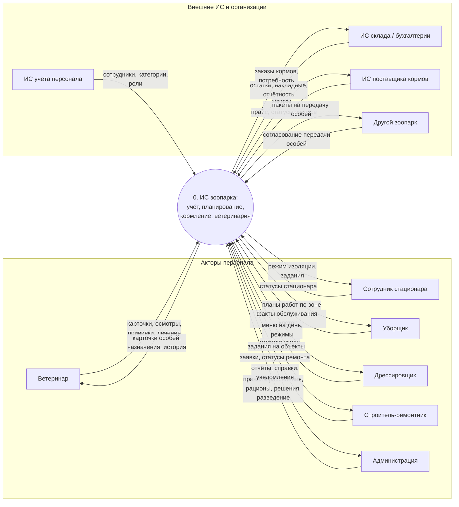

# Диаграммы потоков данных (DFD) — ИС зоопарка (вариант 20)

Документ содержит диаграммы потоков данных в нотации **DFD**, оформленные на языке **Mermaid** (тип `flowchart`). Отражены внешние сущности (акторы и внешние ИС), **процессы** (функции системы, согласованные с вариантами использования из SRS), **хранилища данных** и **потоки данных** между ними.

**Условные обозначения в диаграммах:**

| Элемент | Смысл |
|--------|--------|
| Прямоугольник со скруглением / узел процесса | Процесс (преобразование данных) |
| `D*[(…)]` | Хранилище данных |
| Подпись на стрелке | Состав потока данных (кратко) |
| Внешний подграф | Акторы человека или внешняя ИС |

---

## Уровень 0 — контекстная DFD

Показывает ИС зоопарка как **единый процесс** и основные потоки данных с внешними участниками без декомпозиции внутренних хранилищ.

---

## Уровень 1 — декомпозиция процессов и хранилища данных

Декомпозирует функциональность ИС на процессы **P1–P7** и связывает их с **хранилищами D1–D8**. Потоки подписаны по смыслу данных; один процесс может читать и записывать несколько хранилищ.

### Хранилища данных (логический состав)

| Код | Наименование | Содержание (основные данные) |
|-----|----------------|-------------------------------|
| **D1** | Персонал и доступ | Учётные записи, категории служащих, роли, привязка к зонам, журнал доступа в клетки |
| **D2** | Особи и карточки | Реквизиты особи, вид, возраст, состояние, климат, история изменений карточки |
| **D3** | Клетки и размещение | Клетки, атрибуты (отапливаемая и т.д.), соседство, факт размещения особей, журнал перемещений |
| **D4** | Ветеринарные записи | Медосмотры, прививки, лечение, изоляция/стационар |
| **D5** | Корма, поставщики, заказы | Справочник кормов, поставщики, заказы, связь с внешним складом |
| **D6** | Рационы и меню | Правила рационов, сгенерированное меню на дату по особям |
| **D7** | Разведение и потомство | Пары, ожидаемое/фактическое потомство, решения администрации |
| **D8** | Инфраструктура и обслуживание | Заявки на ремонт, статусы готовности, регистрация работ уборки |

### Процессы уровня 1

| Код | Процесс |
|-----|---------|
| **P1** | Управление персоналом и контроль доступа |
| **P2** | Ведение учёта особей и карточек |
| **P3** | Ветеринарные мероприятия и стационар |
| **P4** | Расселение, совместимость соседей, сезонные переводы |
| **P5** | Обслуживание клеток и ремонт инфраструктуры |
| **P6** | Рационы, меню кормления, взаимодействие со складом и поставщиками |
| **P7** | Разведение, решения по потомству, обмен с другими зоопарками |

```mermaid
flowchart TB
  subgraph Actors[Внешние сущности — люди]
    V[Ветеринар]
    St[Сотрудник стационара]
    C[Уборщик]
    T[Дрессировщик]
    B[Строитель-ремонтник]
    A[Администрация]
  end

  subgraph ExtIS[Внешние ИС]
    HR[ИС персонала]
    Acc[ИС склада / бухгалтерии]
    Sup[ИС поставщика]
    OZ[Другой зоопарк]
  end

  subgraph Processes[Процессы ИС зоопарка]
    P1[P1 Персонал и доступ]
    P2[P2 Особи и карточки]
    P3[P3 Ветеринария и стационар]
    P4[P4 Расселение и сезон]
    P5[P5 Клетки и ремонт]
    P6[P6 Рационы и меню]
    P7[P7 Разведение]
  end

  D1[(D1 Персонал)]
  D2[(D2 Особи)]
  D3[(D3 Клетки)]
  D4[(D4 Ветеринария)]
  D5[(D5 Корма и заказы)]
  D6[(D6 Рационы и меню)]
  D7[(D7 Разведение)]
  D8[(D8 Инфраструктура)]

  HR -->|сотрудники, роли| P1
  A -->|зоны, политика доступа| P1
  P1 <-->|чтение/запись| D1

  V -->|данные карточки| P2
  A -->|регистрация особи| P2
  P2 <-->|чтение/запись| D2

  V -->|осмотры, прививки,\nлечение, изоляция| P3
  St -->|статусы стационара| P3
  P3 <-->|чтение/запись| D4
  P3 -->|идентификация особи| D2

  A -->|размещение, перевод зимой| P4
  P4 <-->|чтение/запись| D2
  P4 <-->|чтение/запись| D3

  C -->|обслуживание| P5
  B -->|ремонт| P5
  A -->|приоритет заявок| P5
  P5 <-->|чтение/запись| D8
  P5 -->|готовность клетки| D3

  A -->|правила рационов| P6
  T -->|запрос меню| P6
  P6 <-->|чтение/запись| D6
  P6 <-->|чтение/запись| D5
  P6 -->|потребность по особям| D2
  Acc <-->|остатки, заказы| P6
  Sup <-->|заказы, статусы| P6

  A -->|пары, решения| P7
  P7 <-->|чтение/запись| D7
  P7 -->|условия особей| D2
  P7 -->|размещение потомства| D3
  OZ <-->|передача данных особей| P7
```

При проверке совместимости соседних клеток процесс **P4** использует атрибуты вида особи (в т.ч. класс «хищник/травоядное»), хранящиеся в составе данных об особях (**D2**), и правила из предметных справочников.

---

## Связь DFD с вариантами использования (SRS)

| Группа процессов | Примеры вариантов использования (разд. 2.4 SRS) |
|------------------|--------------------------------------------------|
| P1 | Обмен данными о сотрудниках и ролях |
| P2 | Регистрация особи, ведение карточки |
| P3 | Медосмотры, прививки, лечение, изоляция, статус стационара |
| P4 | Планирование расселения, совместимость соседей, сезонный перевод |
| P5 | Обслуживание клеток, заявки на ремонт, уведомление о готовности |
| P6 | Рационы, меню на день, учёт кормов, заказы, обмен со складом/поставщиком |
| P7 | Пары для разведения, решение о потомстве, обмен с другим зоопарком |
