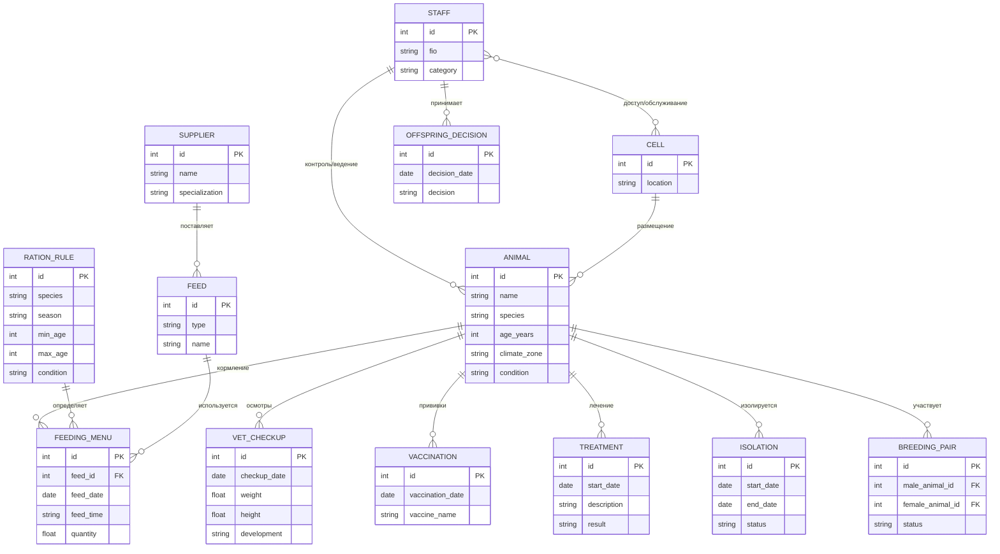

# Спецификация требований к программному обеспечению

## для Информационной системы зоопарка (Вариант 20)

Версия: 0.3  
Разработал: Сухинин Александр Михайлович, РИЗ-420045д  
Организация: Администрация зоопарка  
Дата изменения: 20.03.2026

## Оглавление
<!-- Оглавление -->
* [1. Введение](#1-введение)
    * [1.1 Цель](#11-цель)
    * [1.2 Область применения](#12-область-применения)
    * [1.3 Определения и сокращения](#13-определения-и-сокращения)
    * [1.4 Ссылки](#14-ссылки)
* [2. Общее описание продукта](#2-общее-описание-продукта)
    * [2.1 Перспектива продукта](#21-перспектива-продукта)
    * [2.2 Функционал продукта](#22-функционал-продукта)
    * [2.3 Классы и характеристики пользователей](#23-классы-и-характеристики-пользователей)
    * [2.4 Варианты использования](#24-варианты-использования)
* [3. Функции продукта](#3-функции-продукта)
    * [3.1 Учёт служащих, категории и разграничение доступа к клеткам](#31-учёт-служащих-категории-и-разграничение-доступа-к-клеткам)
    * [3.2 Регистрация особи и ведение карточки](#32-регистрация-особи-и-ведение-карточки)
    * [3.3 Ветеринарное сопровождение: осмотры, прививки, лечение, стационар](#33-ветеринарное-сопровождение-осмотры-прививки-лечение-стационар)
    * [3.4 Расселение, совместимость соседних клеток и сезонные переводы](#34-расселение-совместимость-соседних-клеток-и-сезонные-переводы)
    * [3.5 Обслуживание клеток и ремонт инфраструктуры](#35-обслуживание-клеток-и-ремонт-инфраструктуры)
    * [3.6 Рационы, меню кормления, корма, поставщики и закупки](#36-рационы-меню-кормления-корма-поставщики-и-закупки)
    * [3.7 Разведение, потомство и взаимодействие с другими зоопарками](#37-разведение-потомство-и-взаимодействие-с-другими-зоопарками)
* [4. Требования к данным](#4-требования-к-данным)
    * [4.1 Диаграммы потоков данных](#41-диаграммы-потоков-данных)
    * [4.2 ER-диаграммы](#42-er-диаграммы)
* [5. Внешние интерфейсы](#5-внешние-интерфейсы)
    * [5.1 Пользовательские интерфейсы](#51-пользовательские-интерфейсы)
    * [5.2 Программные интерфейсы](#52-программные-интерфейсы)
    * [5.3 Аппаратные интерфейсы](#53-аппаратные-интерфейсы)
    * [5.4 Коммуникационные интерфейсы](#54-коммуникационные-интерфейсы)
* [6. Нефункциональные требования](#6-нефункциональные-требования)
    * [6.1 Производительность](#61-производительность)
    * [6.2 Надежность и доступность](#62-надежность-и-доступность)
    * [6.3 Информационная безопасность и сохранность данных](#63-информационная-безопасность-и-сохранность-данных)
    * [6.4 Удобство использования](#64-удобство-использования)
* [7. Прочие требования](#7-прочие-требования)
    * [7.1 Ограничения проектирования и реализации](#71-ограничения-проектирования-и-реализации)
<!-- Оглавление -->

## История изменений

| Автор | Дата | Описание | Версия |
|-------|------|----------|--------|
| Сухинин Александр Михайлович, РИЗ-420045д | 20.03.2026 | Заполнена спецификация требований для варианта 20 | 0.1 |
| Сухинин Александр Михайлович, РИЗ-420045д | 21.03.2026 | Детализация функций продукта, функциональные требования и диаграммы деятельности (PlantUML) | 0.2 |
| Сухинин Александр Михайлович, РИЗ-420045д | 21.03.2026 | Требования к данным: DFD уровней 0 и 1 в [dfd.md](dfd.md) (Mermaid) | 0.3 |

## 1. Введение
<!-- Раздел «Введение» устанавливает основу для Спецификации требований, подробно описывая цель документа, сферу его применения и критически важную терминологию. Определение этих элементов на раннем этапе снижает двусмысленность и гарантирует читателям с различным техническим опытом понимание основных целей проекта -->

### 1.1 Цель
Целью разработки информационной системы зоопарка (вариант 20) является создание единого цифрового пространства для учета животных и служащих, планирования их размещения и кормления, а также ведения ветеринарной документации. В рамках своей работы я стремлюсь:

* организовать учет категорий служащих и разграничение доступа к клеткам животных;
* обеспечить планирование расселения с учетом климатических условий и совместимости видов в соседних клетках;
* автоматизировать формирование ежедневного меню кормления на основе рациона, зависящего от вида животного, возраста, физического состояния и сезона;
* вести карточки особей, фиксировать медосмотры, динамику показателей (вес, рост, развитие), прививки, назначения лечения и при необходимости изоляцию в стационаре;
* поддержать процесс администрирования возможного потомства: фиксация подходящих пар, контроль условий и последующие решения администрации (оставить в зоопарке, обменять или передать в другие зоопарки).

### 1.2 Область применения
Область применения разрабатываемой информационной системы зоопарка включает автоматизацию процессов, связанных с эксплуатацией зоопарка как организации, где:

* существуют категории служащих (ветеринары, уборщики, дрессировщики, строители-ремонтники, администрация), у каждой из которых предусмотрены роли и допуски;
* ведется учет животных разных климатических зон, включая перевод части животных на зиму в отапливаемые помещения;
* при расселении учитываются потребности вида и совместимость животных в соседних клетках (например, предотвращение размещения хищников рядом с их добычей);
* организовано кормление с учетом типов кормов (растительный, живой, мясо, комбикорма), наличия поставщиков и возможности собственного производства части кормов;
* реализуется ветеринарное сопровождение: медосмотры, мониторинг показателей развития, прививки, ведение назначений лечения и фиксация изоляции больных животных;
* рассматривается разведение животных при наличии подходящих пар по возрасту и физическому состоянию, а также документируются решения администрации по дальнейшей судьбе потомства.

В рамках проекта система предназначена для ведения и обработки данных, планирования расписаний и подготовки управленческой информации для пользователей разных ролей. При этом физические действия (перенос животных, кормление, проведение осмотров и процедур) выполняются сотрудниками зоопарка, а система обеспечивает регистрацию, согласование и хранение результатов и назначений.

### 1.3 Определения и сокращения
<!-- предоставляет глоссарий для стандартизации терминов и разъяснения технического языка, обеспечивая единообразное понимание среди заинтересованных сторон -->

| Термин | Определение |
|--------|-------------|
| Особь | Животное как единица учета (конкретная индивидуальная запись). |
| Вид | Биологический вид животного (используется при расчете рациона и совместимости). |
| Категория служащих | Профессиональная направленность персонала (ветеринар, уборщик, дрессировщик, строители-ремонтники, администрация). |
| Карточка особи | Учетно-ветеринарная карточка, заводимая при появлении особи в зоопарке. |
| Климатическая зона | Природная зона обитания вида; влияет на необходимость зимнего перевода в отапливаемые помещения. |
| Клетка | Помещение/вольер для содержания животных. |
| Рацион | Набор норм питания, зависящий от вида, возраста, физического состояния и сезона. |
| Меню на день | План кормления для конкретного животного: время, количество и вид пищи. |
| Корм | Пищевой продукт, используемый в рационе (разделяется на растительный, живой, мясо и комбикорма). |
| Поставщик кормов | Поставщик, специализирующийся на определенных типах/видах кормов. |
| Медосмотр | Регулярная процедура оценки состояния животного (вес, рост, развитие и т.п.). |
| Прививка | Фиксация выполнения профилактических мероприятий по графику. |
| Лечение | Назначения при заболевании и фиксация результатов лечения. |
| Изоляция/стационар | Временное отдельное содержание больных животных по назначению ветеринара. |
| Пара особей | Две особи, подходящие друг другу для возможного появления потомства по возрасту и физическому состоянию. |
| Совместимость размещения | Правило расселения, учитывающее недопустимость соседства «хищник-добыча». |

Сокращения:

| Сокращение | Расшифровка |
|------------|-------------|
| ИС | Информационная система |
| СУБД | Система управления базами данных |
| ИБ | Информационная безопасность |

### 1.4 Ссылки
<!-- содержит ссылки на литературу в которой можно найти основания использованных технологий и фактов -->

1. [Sommerville I. Software Engineering](https://www.goodreads.com/book/show/2716.Software_Engineering)
2. [ISO/IEC/IEEE 29148:2011 Requirements engineering](https://www.iso.org/standard/52065.html)
3. [UML — Unified Modeling Language (OMG)](https://www.omg.org/spec/UML/)
4. [Mermaid.js documentation](https://mermaid.js.org/)
5. [PlantUML documentation](https://plantuml.com/)

## 2. Общее описание продукта
<!-- В этом разделе представлен общий обзор программного обеспечения, помогающий читателям понять контекст, пользователей и цели системы -->

### 2.1 Перспектива продукта
<!-- описывает, как программное обеспечение вписывается в более крупную систему или соотносится с существующими продуктами, включая зависимости, интерфейсы или интеграции -->
Информационная система зоопарка рассматривается как единый инструмент учета и планирования внутри предприятия. Она обеспечивает переход от разрозненных бумажных журналов и ведомостей к централизованному хранению данных и быстрому доступу к ним по ролям.

Система находится в контуре повседневных процессов зоопарка и поддерживает следующие типы взаимодействий:
* ввод/ведение учетных данных (особи, клетки, рацион, медкарты);
* планирование операций (расселение, сезонные переводы, меню кормления);
* фиксация выполнения процедур и решений (медосмотры, прививки, лечение, изоляция, решения по потомству).

Пользователь взаимодействует с ИС через интерфейс, а на уровне данных ИС связывает между собой сущности: животные, клетки, корма, ветеринарные процедуры и решения администрации.

### 2.2 Функционал продукта
<!-- обобщает основные функции, предоставляя функциональный обзор, который объясняет основные возможности программного обеспечения, не вдаваясь в подробные детали -->

Основные функции системы (детализированы в разделе 3):
* **F1.** Учёт служащих по категориям, синхронизация с ИС персонала, разграничение доступа (в том числе допуск в клетки только для ветеринаров, уборщиков и дрессировщиков);
* **F2.** Регистрация особи при поступлении в зоопарк и ведение карточки особи;
* **F3.** Ветеринарное сопровождение: медосмотры, прививки, лечение, изоляция в стационаре и выписка;
* **F4.** Планирование расселения по клеткам с учётом климатических зон, зимних переводов в отапливаемые помещения и совместимости с соседями (в т.ч. хищник–добыча);
* **F5.** Обслуживание клеток (уборщик) и ремонт инфраструктуры (строитель-ремонтник) с уведомлением администрации;
* **F6.** Рационы и ежедневное меню кормления, справочник кормов (включая собственное производство), поставщики, взаимодействие со складом и заказами;
* **F7.** Разведение: фиксация подходящих пар, учёт потомства и решения администрации (оставить, обмен, передача), обмен данными с другими зоопарками.

Предполагаемые взаимодействия с другими информационными системами организации:
* `ИС учета персонала` (или кадровая система): обмен данными о сотрудниках для корректного назначения ролей и прав доступа в ИС зоопарка;
* `ИС складского учета и/или бухгалтерии`: получение/передача данных о поставках кормов, остатках, документах закупок и отчетных показателях;
* `внешние системы поставщиков кормов`: формирование заказов и получение справочной информации (наличие, цены, ассортимент) по специализированным типам кормов.

Диаграммы потоков данных (DFD уровня 0 и уровня 1 с хранилищами и процессами) приведены в файле [dfd.md](dfd.md).

### 2.3 Классы и характеристики пользователей
<!-- определяет различные типы конечных пользователей, отмечает конкретные потребности или ограничения пользователей для разработки дизайна, ориентированного на пользователя -->

| Актор | Краткое описание |
|-------|------------------|
| Ветеринар | Проводит медосмотры, ведет карточки особей, фиксирует прививки, назначает лечение и оформляет изоляцию/стационар. |
| Сотрудник стационара | Обрабатывает больных животных в период изоляции по назначению ветеринара и фиксирует статус «на лечении/выписан». |
| Уборщик | Выполняет регламентные работы по обслуживанию клеток и поддержанию условий содержания в рамках своей зоны ответственности. |
| Дрессировщик | Осуществляет подготовку животных к тренировкам и использует меню кормления для планирования ухода. |
| Строитель-ремонтник | Проводит ремонт и обслуживание инфраструктуры (клетки, помещения), получая заявки на работы и уведомления о готовности. |
| Администрация | Принимает управленческие решения по размещению животных, разведению и судьбе потомства, формирует отчеты. |
| ИС учета персонала | Передает в ИС зоопарка данные о сотрудниках и их категориях/ролях для корректного разграничения доступа. |
| ИС складского учета и/или бухгалтерии | Обеспечивает обмен данными о поставках/остатках кормов и участвует в формировании потребностей и отчетности. |
| ИС поставщика кормов | Получает заказы на корма и возвращает статусы поставок, ассортимент и справочную информацию по типам кормов. |
| Другой зоопарк/принимающая сторона | Обменивается заявками и данными при передаче/обмене потомства по решению администрации. |

### 2.4 Варианты использования
<!-- определяет перечень сценариев взаимодействия пользователей с программным обеспечением -->

| Вариант использования | Краткое описание |
|-----------------------|------------------|
| Регистрация особи и создание карточки | Для актера «Ветеринар»: создать карточку особи с базовыми биологическими параметрами и учетными данными. |
| Ведение карточки особи | Для актера «Ветеринар»: просматривать и обновлять параметры, заметки и историю событий по особи. |
| Проведение медосмотра | Для актера «Ветеринар»: фиксировать вес, рост, развитие и результаты наблюдений в периодическом порядке. |
| Планирование прививок | Для актера «Ветеринар»: определить график вакцинации и привязку к конкретной особи. |
| Фиксация выполнения прививок | Для актера «Ветеринар»: отметить факт выполнения прививки и сохранить сведения о типе/препарате. |
| Назначение лечения | Для актера «Ветеринар»: сформировать назначения при заболевании с датой начала и описанием процедур. |
| Ведение результата лечения | Для актера «Ветеринар»: указать итог лечения и обновить состояние особи. |
| Оформление изоляции | Для актера «Ветеринар»: назначить изоляцию/стационар и контролировать ее срок. |
| Управление статусом лечения в стационаре | Для актера «Сотрудник стационара»: отмечать текущий статус изоляции (на лечении/готов к выписке). |
| Снятие изоляции/выписка | Для актера «Ветеринар»: завершить изоляцию при выполнении условий и перевести особь в обычный режим. |
| Обслуживание клеток | Для актера «Уборщик»: выполнять работы по содержанию клеток и регистрировать их выполнение в ИС. |
| Доступ к плану работ по уходу | Для актера «Уборщик»: получать из ИС актуальный перечень задач и сроки по закрепленным клеткам. |
| Получение меню кормления на день | Для актера «Дрессировщик»: просматривать меню кормления, необходимое для ухода и подготовки животных. |
| Поддержка режима ухода для тренировок | Для актера «Дрессировщик»: согласовывать режим подготовки животных с расписанием кормления и особенностями ухода. |
| Планирование расселения | Для актера «Администрация»: определить размещение животных по клеткам с учетом правил совместимости и климатических требований. |
| Проверка совместимости соседних клеток | Для актера «Администрация»: выполнять автоматическую проверку запретов (например, хищник–добыча) при выборе клеток. |
| Сезонный перевод животных | Для актера «Администрация»: инициировать перевод части животных в отапливаемые помещения и обновить условия содержания. |
| Заявка на ремонт/обслуживание инфраструктуры | Для актера «Строитель-ремонтник»: принимать и выполнять заявки на ремонт клеток и помещений. |
| Уведомление о готовности работ | Для актера «Администрация»: получать подтверждение о выполнении ремонтных работ для дальнейшего расселения. |
| Формирование рациона и правил кормления | Для актера «Администрация»: задавать правила рациона по видам/возрастам/состояниям и сезонам. |
| Формирование меню кормления на день | Для актера «Администрация»: автоматически рассчитывать меню кормления (время, количество, тип корма) для каждой особи. |
| Учет кормов и поставщиков | Для актера «Администрация»: вести справочники кормов и поставщиков, включая специализацию поставщика. |
| Обмен данными о сотрудниках и ролях | Для актера «ИС учета персонала»: передать в ИС зоопарка список сотрудников и их категории для разграничения доступа. |
| Обмен данными с ИС складского учета/бухгалтерии по остаткам | Для актера «ИС складского учета и/или бухгалтерии»: предоставлять данные об остатках и потребностях по кормам. |
| Формирование заказов на корма | Для актера «Администрация»: создавать заявки/заказы на корма на основе дефицита и плана потребления. |
| Передача заказов поставщику и получение статусов | Для актера «ИС поставщика кормов»: обмениваться статусами заказов и информацией о доступности кормов. |
| Фиксация подходящих пар для разведения | Для актера «Администрация»: отмечать пары особей, подходящих по возрасту и состоянию, для последующего учета разведения. |
| Оформление решения о потомстве | Для актера «Администрация»: выбрать вариант судьбы потомства (оставить/обменять/передать). |
| Обмен данными с другим зоопарком | Для актера «Другой зоопарк/принимающая сторона»: передавать и принимать данные о передаче/обмене животных и согласовывать детали. |

Диаграмма вариантов использования (Use Case Diagram) представлена в файле [usecase.puml](usecase.puml)

## 3. Функции продукта
<!-- Описывает основные действия, которые должно выполнять программное обеспечение, такие как обработка данных, действия пользовательского интерфейса или ответы системы на определенные входные данные. Каждое требование должно быть четким, проверяемым и документированным с примерами или вариантами использования, где это применимо -->

Ниже перечислены функции продукта, выделенные по результатам анализа вариантов использования (раздел 2.4). Для каждой функции приведены краткое описание, приоритет, проверяемые функциональные требования и ссылка на диаграмму деятельности в формате PlantUML.

### 3.1 Учёт служащих, категории и разграничение доступа к клеткам

#### 3.1.1 Краткое описание и приоритет
Функция обеспечивает соответствие учётных записей в ИС зоопарка категориям персонала (ветеринар, уборщик, дрессировщик, строитель-ремонтник, администрация) и уникальным профессиональным атрибутам, а также применение правил допуска: **в клетки к животным** разрешён вход только у ветеринаров, уборщиков и дрессировщиков. Синхронизация с внешней ИС учёта персонала снижает расхождения в ролях.

**Приоритет:** высокий (безопасность животных и персонала, соблюдение регламентов).

#### 3.1.2 Функциональные требования
Система должна:
* FR-3.1-01 — хранить для каждого пользователя категорию служащих и набор профессиональных атрибутов, определяемых категорией (например, специализация ветеринара, зона ответственности уборщика);
* FR-3.1-02 — импортировать или обновлять данные о сотрудниках и ролях из ИС учёта персонала (см. вариант «Обмен данными о сотрудниках и ролях») с журналированием сеансов синхронизации;
* FR-3.1-03 — запрещать операции «внутри клетки» (отметки ухода, процедуры, доступ к деталям содержания в зоне клетки) для категорий **администрация** и **строитель-ремонтник**, если это не предусмотрено отдельным исключением в политике ИБ;
* FR-3.1-04 — разрешать операции в клетке для категорий **ветеринар**, **уборщик**, **дрессировщик** при наличии привязки к зоне/клетке;
* FR-3.1-05 — фиксировать в журнале аудита отказы в доступе и успешные входы в зону клетки.

**Диаграмма деятельности (пользовательский поток):** [activity-01-personnel-access.puml](activity-01-personnel-access.puml)

---

### 3.2 Регистрация особи и ведение карточки

#### 3.2.1 Краткое описание и приоритет
Функция покрывает появление особи в зоопарке: создание **карточки особи** с параметрами, влияющими на рацион, климат и разведение, и дальнейшее ведение истории изменений.

**Приоритет:** высокий (база данных для всех остальных процессов).

#### 3.2.2 Функциональные требования
Система должна:
* FR-3.2-01 — создавать карточку при регистрации особи: вид, возраст (или дата рождения), пол при необходимости, климатическая зона вида, идентификаторы, физическое состояние;
* FR-3.2-02 — обеспечивать просмотр и редактирование карточки уполномоченными ролями с версионированием или журналом изменений ключевых полей;
* FR-3.2-03 — хранить агрегированную историю событий по особи (ссылки на медосмотры, прививки, перемещения, кормление — для навигации из карточки);
* FR-3.2-04 — валидировать обязательные поля, форматы дат и допустимые диапазоны числовых показателей.

**Связанные варианты использования:** «Регистрация особи и создание карточки», «Ведение карточки особи».

**Диаграмма деятельности:** [activity-02-animal-card.puml](activity-02-animal-card.puml)

---

### 3.3 Ветеринарное сопровождение: осмотры, прививки, лечение, стационар

#### 3.3.1 Краткое описание и приоритет
Функция поддерживает работу ветеринара по контролю веса, роста, развития, плановым и фактическим прививкам, назначению лечения и изоляции больных в стационаре с участием сотрудника стационара.

**Приоритет:** высокий.

#### 3.3.2 Функциональные требования
Система должна:
* FR-3.3-01 — регистрировать медосмотры с датой, весом, ростом, оценкой развития и текстовыми наблюдениями;
* FR-3.3-02 — вести план прививок и фиксировать выполнение (препарат, дата, исполнитель);
* FR-3.3-03 — создавать назначения лечения со статусом и описанием процедур;
* FR-3.3-04 — оформлять изоляцию в стационаре: период, место, статус; позволять сотруднику стационара обновлять промежуточный статус;
* FR-3.3-05 — обеспечивать завершение лечения и выписку с проверкой непротиворечивости дат (нельзя завершить изоляцию раньше начала);
* FR-3.3-06 — ограничивать право изменения ветеринарных записей ролями **ветеринар** (и администрация — в режиме контроля/отчётности, если задано политикой).

**Диаграмма деятельности:** [activity-03-veterinary.puml](activity-03-veterinary.puml)

---

### 3.4 Расселение, совместимость соседних клеток и сезонные переводы

#### 3.4.1 Краткое описание и приоритет
Функция обеспечивает размещение хищников и травоядных с учётом потребностей вида, **климатической зоны** и **зимнего перевода** в отапливаемые помещения, а также проверку **совместимости с соседними клетками** (запрет соседства хищника и его добычи и других правил из справочника).

**Приоритет:** высокий.

#### 3.4.2 Функциональные требования
Система должна:
* FR-3.4-01 — хранить атрибуты клеток: тип (отапливаемая/нет), соседство с другими клетками, пригодность для видов;
* FR-3.4-02 — при назначении клетки проверять правила совместимости между размещаемым видом и видами в соседних клетках;
* FR-3.4-03 — учитывать сезон при валидации: для видов, требующих зимнего содержания, предлагать или требовать отапливаемую клетку;
* FR-3.4-04 — поддерживать массовый сценарий сезонного перевода с отчётом о конфликтах размещения;
* FR-3.4-05 — вести журнал перемещений особей между клетками.

**Диаграмма деятельности:** [activity-04-housing.puml](activity-04-housing.puml)

---

### 3.5 Обслуживание клеток и ремонт инфраструктуры

#### 3.5.1 Краткое описание и приоритет
Функция объединяет регламентное обслуживание клеток уборщиком (план работ, фиксация выполнения) и цикл заявок на ремонт для строителя-ремонтника с уведомлением администрации о готовности.

**Приоритет:** средний.

#### 3.5.2 Функциональные требования
Система должна:
* FR-3.5-01 — формировать для уборщика перечень задач по закреплённым клеткам и срокам;
* FR-3.5-02 — позволять регистрировать факт выполнения работ и замечания по состоянию клетки;
* FR-3.5-03 — поддерживать заявки на ремонт: создание, назначение, статусы выполнения;
* FR-3.5-04 — уведомлять администрацию о завершении ремонта, влияющего на возможность расселения;
* FR-3.5-05 — блокировать или предупреждать о расселении в клетке со статусом «не готова/ремонт».

**Диаграмма деятельности:** [activity-05-cages-maintenance.puml](activity-05-cages-maintenance.puml)

---

### 3.6 Рационы, меню кормления, корма, поставщики и закупки

#### 3.6.1 Краткое описание и приоритет
Функция описывает типы кормов (растительный с подтипами фрукты/овощи/зерно/сено, живой — мыши, птицы, корм для рыб, мясо, комбикорма), расчёт **рациона** с учётом возраста, состояния и сезона, формирование **меню на каждый день** (время, количество, вид пищи), учёт **поставщиков** со специализацией, **собственного производства** части кормов, а также заказы и обмен с ИС склада и поставщика.

**Приоритет:** высокий.

#### 3.6.2 Функциональные требования
Система должна:
* FR-3.6-01 — вести справочник кормов с типом и подтипом, признаком «собственное производство»;
* FR-3.6-02 — вести справочник поставщиков с привязкой к типам/кормам, которые они поставляют;
* FR-3.6-03 — хранить правила рациона по виду, возрастным интервалам, физическому состоянию и сезону;
* FR-3.6-04 — автоматически формировать меню кормления на выбранную дату для каждой особи (время приёма, количество, корм), с возможностью ручной корректировки уполномоченной ролью;
* FR-3.6-05 — агрегировать потребность в кормах по меню и сопоставлять с остатками (данные ИС складского учёта);
* FR-3.6-06 — формировать заказы поставщикам и получать статусы поставок (см. варианты обмена с ИС поставщика);
* FR-3.6-07 — предоставлять дрессировщику просмотр меню на день по закреплённым особям.

**Диаграмма деятельности:** [activity-06-feeding-supply.puml](activity-06-feeding-supply.puml)

---

### 3.7 Разведение, потомство и взаимодействие с другими зоопарками

#### 3.7.1 Краткое описание и приоритет
Функция поддерживает фиксацию **пары особей** при выполнении условий (возраст, физическое состояние), учёт ожидаемого/фактического потомства и **решение администрации**: оставить в зоопарке, обменять или передать в другие зоопарки, с обменом данными с принимающей стороной.

**Приоритет:** средний.

#### 3.7.2 Функциональные требования
Система должна:
* FR-3.7-01 — позволять регистрировать пару разведения с проверкой совместимости вида, возраста и состояния особей;
* FR-3.7-02 — вести статусы пары и события (ожидание, потомство, закрытие пары);
* FR-3.7-03 — при решении «оставить в зоопарке» инициировать создание карточек для потомства и план условий содержания;
* FR-3.7-04 — при решениях «обмен» или «передача» формировать пакет данных для другого зоопарка и фиксировать статус согласования;
* FR-3.7-05 — хранить историю решений администрации с датой и ответственным лицом.

**Диаграмма деятельности:** [activity-07-breeding.puml](activity-07-breeding.puml)

## 4. Требования к данным
<!--  Описание различных аспектов данных, которые будет потреблять
система в качестве входной информации, как-то обрабатывать и возвращать
в виде выходной информации -->

### 4.1 Диаграммы потоков данных

На основе описания деятельности зоопарка (индивидуальный вариант 20), акторов и вариантов использования (раздел 2.4) построены диаграммы потоков данных **DFD уровня 0** (контекстная: система как единый процесс) и **DFD уровня 1** (декомпозиция на процессы P1–P7, хранилища D1–D8, потоки между акторами, процессами, внешними ИС и хранилищами).

Полное описание, таблицы состава хранилищ и обе диаграммы в нотации **Mermaid** находятся в отдельном файле:

**[dfd.md](dfd.md)**

Дублирование диаграмм в данном разделе не выполняется: актуальная версия — в указанном файле.

### 4.2 ER-диаграммы
ER-диаграмма (упрощенная модель сущностей):

## 5. Внешние интерфейсы
<!-- Описывает то, как система будет взаимодействовать с внешним миров. Какие API, как получить те или иные данные и тп. Подразделы служат для детализации требований -->

### 5.1 Пользовательские интерфейсы
<!-- взаимодействие с пользователем (элементы пользовательского интерфейса, диалоги, потоки); руководства по дизайну/стилю -->
Интерфейс системы предполагается реализовать в виде веб-страниц/форм с ролевым доступом. Основные пользовательские сценарии:
* авторизация пользователя и выбор доступного меню по его категории;
* работа с карточками особей (просмотр, добавление медосмотров, запись прививок, назначение лечения);
* ведение списка клеток и расселения (подбор клетки с учетом совместимости и сезонных переводов);
* формирование меню кормления на день для конкретной особи и просмотр истории кормлений;
* оформление изоляции/стационара и контроль сроков;
* оформление пар для разведения и отображение решений администрации по потомству.

В интерфейсе должны быть предусмотрены:
* формы ввода с валидацией (даты, числовые параметры, статусы);
* фильтры и поиск (по виду, клетке, периоду времени, состоянию);
* журнал событий в карточке особи (медосмотры, прививки, лечение, изоляция).

### 5.2 Программные интерфейсы
<!-- интеграция с другими системами (API, владелец и т.д.) -->
Для лабораторного проекта предполагается программная интеграция через логический программный интерфейс (например, REST API) и поддержка типовых операций:
* получение справочников (виды животных, типы кормов, сезоны, категории служащих, правила совместимости);
* создание/изменение записей (карточки особей, размещения, рационы, меню кормления, ветеринарные процедуры);
* формирование отчетов и выгрузок (например, `CSV`/`XLSX`) для администрации;
* возможность обмена данными с внешними средствами учреждения через импорт/экспорт (в рамках образовательного проекта).

### 5.3 Аппаратные интерфейсы
<!-- взаимодействия с физическими устройствами (типы, сигналы и т.д.) -->
Базовый сценарий — ручной ввод данных с клавиатуры и мыши.
Опционально предусматривается идентификация особей по меткам (штрихкод/QR-код), чтобы быстрее находить карточку.

### 5.4 Коммуникационные интерфейсы
<!-- интерфейсы связи и коммуникации -->
Система должна обеспечивать:
* доступ к данным через `HTTPS`;
* безопасную передачу информации между клиентом и сервером;
* журналирование действий пользователей для аудита.
Дополнительно возможна рассылка уведомлений (например, напоминания о плановых медосмотрах/прививках) через внешний почтовый сервис.

## 6. Нефункциональные требования
<!-- Относится к производительности системы, безопасности, надежности и удобству использования. Например, может указывать время отклика, стандарты защиты данных или критерии доступности -->

### 6.1 Производительность
<!-- время (задержка, пропускная способность и т.д.) и пространство (память, хранилище, полоса пропускания и т.д.) -->
Целевые показатели производительности (ориентировочно для лабораторного проекта):
* время отклика интерфейса на типовые операции (поиск/открытие карточки, сохранение формы) — до 2–3 секунд;
* генерация стандартных отчетов по фильтрам — до 10 секунд;
* поддержка одновременной работы нескольких пользователей (десятки) без критических задержек.

### 6.2 Надежность и доступность
<!-- способность стабильно работать в соответствии с заданными требованиями (среднее время безотказной работы, избыточность/отказоустойчивость, кэши и т. д.) и готовность к предоставлению услуг (целевые SLA, окна обслуживания, восстановление и т. д.)-->
Для обеспечения надежности и доступности я предусматриваю:
* транзакционность операций записи (чтобы данные не терялись при сбоях);
* регулярное резервное копирование базы данных и проверку восстановления;
* ведение журнала событий/ошибок для поиска причин проблем;
* корректную обработку отказов (сообщения пользователю без потери введенных данных).

### 6.3 Информационная безопасность и сохранность данных
<!-- защита данных, идентификационных данных и операций (транзит/отдых, аутентификация, шифрование и т. д.); безопасность, конфиденциальность, приватность, целостность и доступность -->
Система должна обеспечивать:
* аутентификацию пользователей (логин/пароль) и безопасное хранение паролей (хеширование);
* ролевой контроль доступа (RBAC) с разграничением прав на операции: например, назначение лечения и управление изоляцией только для уполномоченных ролей;
* защищенную передачу данных по сети (`HTTPS`);
* журналирование ключевых действий (особенно административных и ветеринарных операций);
* контроль целостности данных (валидация, ограничения, связи между сущностями).

### 6.4 Удобство использования
<!-- описывает, насколько легко и эффективно пользователи смогут работать с программным продуктом -->
Удобство использования обеспечивается за счет:
* русскоязычного интерфейса и терминологии предметной области;
* понятных форм ввода и подсказок по обязательным полям;
* ограничений и валидации значений (чтобы уменьшить вероятность ошибок);
* последовательной навигации по разделам в зависимости от роли пользователя.

## 7. Прочие требования
<!-- Описывает требования, не относящиеся ни к одному из предыдущих разделов -->

### 7.1 Ограничения проектирования и реализации
<!-- описывает стандарты и ограничения разработки, включающие языки программирования, базы данных, стандарты кодирования, стандарты обмена данными и пр. -->
При реализации проекта учитываются следующие ограничения:
* спецификация оформляется в формате Markdown;
* диаграммы допускается включать в документ с использованием Mermaid/PlantUML;
* модель данных должна поддерживать связь «особь — события» (медосмотры/прививки/лечение/изоляция) и «особь — размещение» (клетка, сезон, совместимость);
* справочники (виды, корма, типы процедур, правила рациона и совместимости) должны быть непротиворечивыми, чтобы расчеты и планирование не выдавали ошибочные результаты;
* для критичных действий предполагается журналирование изменений (кто/когда/что изменил).